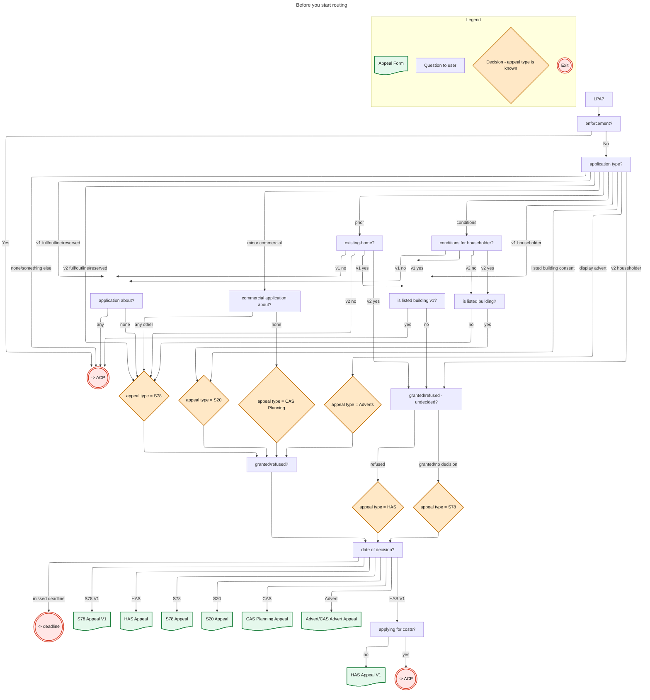

This doc is not auto generated so may get out of date if changes not reflected here

```mermaid
---
title: Before you start routing
---

flowchart TD
    %%{init: {"flowchart": {"defaultRenderer": "elk"}} }%%

    %% Legend
    subgraph Legend
        legQuestion[Question to user]
        legDecision{Decision - appeal type is known}:::decisionStyle
        legAppealForm@{ shape: doc, label: "Appeal Form" }
        legExit(((Exit))):::exitStyle
    end

    %% Exit
    deadline(((-> deadline))):::exitStyle
    acp1(((-> ACP))):::exitStyle

    %% Decisions
    decideHAS{appeal type = HAS}:::decisionStyle
    decideS78A{appeal type = S78}:::decisionStyle
    decideS78B{appeal type = S78}:::decisionStyle
    decideS20{appeal type = S20}:::decisionStyle
    decideCAS{appeal type = CAS Planning}:::decisionStyle
    decideAdvert{appeal type = Adverts}:::decisionStyle

    %% Appeal Forms
    HAS_V1@{ shape: doc, label: "HAS Appeal V1" }
    S78_V1@{ shape: doc, label: "S78 Appeal V1" }
    HAS@{ shape: doc, label: "HAS Appeal" }
    S78@{ shape: doc, label: "S78 Appeal" }
    S20@{ shape: doc, label: "S20 Appeal" }
    CAS@{ shape: doc, label: "CAS Planning Appeal" }
    Advert@{ shape: doc, label: "Advert/CAS Advert Appeal" }

    %% questions
    lpa[LPA?]
    enforcement[enforcement?]
    applicationType[application type?]
    applicationAbout[application about?]
    applicationAboutCAS[commercial application about?]
    existingHome[existing-home?]
    conditionsHouseholder[conditions for householder?]
    listedBuildingV1[is listed building v1?]
    listedBuilding[is listed building?]
    grantedRefused[granted/refused?]
    grantedRefusedUndecided[granted/refused - undecided?]
    decisionDate[date of decision?]
    costsHouseholder[applying for costs?]

    %% routing
    lpa --> enforcement

    enforcement -- Yes --> acp1
    enforcement -- No --> applicationType

    applicationType -- v1 full/outline/reserved --> applicationAbout
    applicationType -- v2 full/outline/reserved --> decideS78A
    applicationType -- v1 householder --> listedBuildingV1
    applicationType -- v2 householder --> grantedRefusedUndecided
    applicationType -- listed building consent --> decideS20
    applicationType -- display advert --> decideAdvert
    applicationType -- minor commercial --> applicationAboutCAS
    applicationType -- prior --> existingHome
    applicationType -- conditions --> conditionsHouseholder
    applicationType -- none/something else --> acp1

    applicationAbout -- any --> acp1
    applicationAbout -- none --> decideS78A

    applicationAboutCAS -- none --> decideCAS
    applicationAboutCAS -- any other --> decideS78A

    existingHome -- v1 yes --> listedBuildingV1
    existingHome -- v1 no --> applicationAbout

    existingHome -- v2 yes --> grantedRefusedUndecided
	existingHome -- v2 no --> decideS78A

    conditionsHouseholder -- v1 yes --> listedBuildingV1
    conditionsHouseholder -- v1 no --> applicationAbout

    conditionsHouseholder -- v2 yes --> listedBuilding
    conditionsHouseholder -- v2 no --> listedBuilding

    listedBuildingV1 -- yes --> acp1
    listedBuildingV1 -- no --> grantedRefusedUndecided

    listedBuilding -- yes --> decideS20
    listedBuilding -- no --> decideS78A

    decideS78A --> grantedRefused
    decideS20 --> grantedRefused
    decideAdvert --> grantedRefused
    decideCAS --> grantedRefused

    grantedRefused --> decisionDate

    grantedRefusedUndecided -- granted/no decision --> decideS78B
    grantedRefusedUndecided -- refused --> decideHAS

    decideHAS --> decisionDate
    decideS78B --> decisionDate

    decisionDate -- missed deadline --> deadline
    decisionDate -- HAS --> HAS
    decisionDate -- S78 --> S78
    decisionDate -- Advert --> Advert
    decisionDate -- CAS --> CAS
    decisionDate -- S20 --> S20
    decisionDate -- S78 V1 --> S78_V1
    decisionDate -- HAS V1 --> costsHouseholder

    costsHouseholder -- no --> HAS_V1
    costsHouseholder -- yes --> acpCosts(((-> ACP))):::exitStyle

    %% styles
    classDef decisionStyle fill:#ffe8c6,stroke:#c26d00,color:#111,stroke-width:2px;
    classDef appealForm fill:#e5f8ec,stroke:#1b7f3c,color:#111,stroke-width:2px;
    classDef exitStyle fill:#ffe6e6,stroke:#d4351c,color:#111,stroke-width:2px;

    class HAS_V1,S78_V1,HAS,S78,S20,Advert,CAS,legAppealForm,example appealForm;
```
